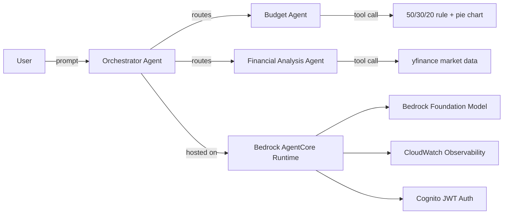

# Building Advanced Agentic Systems on AWS — Personal Account Setup Guide

This turns the lab in [lab-instructions.txt](lab-instructions.txt) into a runnable demo in **your own AWS account**, using real source code under [aws-agentic-lab/](aws-agentic-lab) instead of the Workshop Studio-provided IDE/account.

Stack: **Amazon Bedrock** (foundation models + Guardrails) → **Strands Agents SDK** (agent/tool code) → **Amazon Bedrock AgentCore** (hosting, identity, observability).



---

## 0. Cost & safety notes (read first)

- Bedrock charges per input/output token. Claude 3.5 Sonnet on-demand is a few cents per demo run — negligible for a short demo.
- AgentCore Runtime bills while the agent is deployed/invoked. **Run Task 4 cleanup when you're done.**
- Cognito, ECR, CloudWatch Logs all have generous free tiers for a single-user demo.
- Never commit AWS access keys to source control. Use `aws configure` or SSO, not hardcoded secrets.

---

## 1. AWS account & IAM setup

1. Sign in to your AWS account (console.aws.amazon.com) — any personal/free-tier account works.
2. Create an IAM user (or use IAM Identity Center) dedicated to this lab, e.g. `agentic-lab-admin`.
3. Attach these managed policies (scope down later if you want):
   - `AmazonBedrockFullAccess`
   - `AmazonCognitoPowerUser`
   - `AmazonEC2ContainerRegistryFullAccess`
   - `CloudWatchLogsFullAccess`
   - `AWSCloudFormationFullAccess`
   - `AmazonSSMFullAccess`
   - `IAMFullAccess` (AgentCore creates execution roles on your behalf; you can scope this down post-lab)
   - A custom inline policy granting `bedrock-agentcore:*` and `KMS:*` (this service is newer and not yet in every managed policy)
4. Generate an access key for that user (Security credentials tab) **or** use `aws configure sso` if your org uses IAM Identity Center.
5. Pick a region where Bedrock + AgentCore are available — use **us-east-1** for this guide.

---

## 2. Enable Bedrock model access

1. Open the Bedrock console → **Model access** (left nav).

2. Request access to **Anthropic Claude 3.5 Sonnet** (and optionally Claude 3 Haiku for a cheaper/faster option). Approval is usually instant for on-demand Anthropic models.

3. Confirm access:

   ```powershell
   aws bedrock list-foundation-models --region us-east-1 --by-provider anthropic --query "modelSummaries[].modelId"
   ```

---

## 3. Install local tooling

| Tool | Purpose | Check |
| --- | --- | --- |
| Python 3.12 | Run agent code & notebooks | `python --version` |
| AWS CLI v2 | Auth + verification | `aws --version` |
| Node.js 22+ | AgentCore CLI (`@aws/agentcore`) | `node --version` |
| Docker Desktop (optional) | Only needed if you later switch AgentCore builds to `--build Container` | `docker --version` |
| VS Code + Python/Jupyter extensions | Run the notebooks | already installed |

```powershell
# AWS credentials
aws configure
# region: us-east-1

# AgentCore CLI (current, recommended — replaces the deprecated Python "starter toolkit")
npm install -g @aws/agentcore
agentcore --version
```

---

## 4. Project setup

```powershell
cd "c:\Users\adnan\OneDrive\Desktop\code\aws-agentic-lab"
python -m venv .venv
.\.venv\Scripts\Activate.ps1
pip install -r requirements.txt
python -m ipykernel install --user --name agentic-lab --display-name "Agentic Lab (Python 3.14)"
copy .env.example .env
```

Edit [.env](aws-agentic-lab/.env) if you want a different region or model ID.

---

## 5. Task 1 — Personal Budget Assistant

Open [notebooks/Task-1.ipynb](aws-agentic-lab/notebooks/Task-1.ipynb) in VS Code, select the **Agentic Lab** kernel, **Run All**.

You'll build a single Strands `Agent` with:

- A `@tool` that applies the 50/30/20 budgeting rule
- A `@tool` that renders a pie chart with matplotlib
- Conversation memory (the same `Agent` object retains message history across calls)
- A Pydantic `structured_output()` call that returns a typed `FinancialReport`
- A commented-out example of attaching a Bedrock Guardrail once you create one in the console

---

## 6. Task 2 — Multi-Agent Financial System ("Agents as Tools")

Open [notebooks/Task-2.ipynb](aws-agentic-lab/notebooks/Task-2.ipynb), **Run All**.

You build three agents:

1. **Budget Agent** — same budgeting logic as Task 1, wrapped as a tool function.
2. **Financial Analysis Agent** — uses `yfinance` to pull live stock data, wrapped as a tool function.
3. **Orchestrator Agent** — has both wrapped agents as its `tools=[...]` and routes/synthesizes responses.

Try a combined query like *"I earn $7000/month, how should I budget, and how has AAPL performed this week?"* and watch it call both sub-agents.

---

## 7. Task 3 — Deploy with Amazon Bedrock AgentCore

The deployable entrypoint lives in [agentcore_app/agent.py](aws-agentic-lab/agentcore_app/agent.py) — it's the Task 2 orchestrator wrapped with `BedrockAgentCoreApp` so AgentCore Runtime can host it.

### 7.1 Create the AgentCore project

```powershell
cd "c:\Users\adnan\OneDrive\Desktop\code\aws-agentic-lab"
agentcore create --name AgenticLab --no-agent
cd AgenticLab
```

### 7.2 Add your agent (bring-your-own code)

```powershell
agentcore add agent `
  --name BudgetOrchestrator `
  --type byo `
  --code-location ..\agentcore_app `
  --entrypoint agent.py `
  --language Python `
  --framework Strands `
  --model-provider Bedrock
```

This defaults to `AWS_IAM` inbound auth (simplest for a demo — invoking requires SigV4-signed requests, which `agentcore invoke` handles for you).

### 7.3 (Optional) Add Cognito-backed authentication — matches the lab's Identity objective

```powershell
python ..\scripts\setup_cognito.py
```

This prints a `discovery_url` and `app_client_id`. Re-run (or edit) the agent config with:

```powershell
agentcore add agent `
  --name BudgetOrchestrator `
  --type byo `
  --code-location ..\agentcore_app `
  --entrypoint agent.py `
  --authorizer-type CUSTOM_JWT `
  --discovery-url <discovery_url-from-script> `
  --allowed-clients <app_client_id-from-script>
```

### 7.4 Deploy

```powershell
agentcore validate
agentcore deploy -y
```

This provisions (automatically): an IAM execution role, an ECR repository (for the packaged code), the AgentCore Runtime, and CloudWatch log groups.

### 7.5 Test the deployed agent

```powershell
agentcore status
agentcore invoke "I earn $5000 a month, how should I budget it?"
agentcore invoke "How has AAPL performed this week?"
```

### 7.6 Observability

```powershell
agentcore logs --since 1h
agentcore traces list --limit 10
```

Or view the **CloudWatch → GenAI Observability** dashboard in the console for a graphical trace view.

---

## 8. Task 4 — Clean up AWS resources

From inside `aws-agentic-lab\AgentiLab` (the AgentCore project folder):

```powershell
..\.venv\Scripts\python.exe ..\scripts\cleanup.py
```

This runs `agentcore remove all -y` and `agentcore deploy -y` to remove the AgentCore runtime, its ECR repo, and its IAM role from AWS, then deletes the Cognito user pool created in step 7.3.

It also deletes the `CDKToolkit` bootstrap stack and its retained, versioned asset bucket in the configured AWS region. These are shared by CDK deployments in that account and region; run `cdk bootstrap aws://<account-id>/<region>` before using CDK there again.

**Verify manually in the console afterward** (belt-and-braces for a personal account):

- Bedrock AgentCore → Runtimes (should be empty)
- ECR → Repositories
- Cognito → User pools
- CloudWatch → Log groups (`/aws/bedrock-agentcore/...`)
- IAM → Roles (search `AgentCore` or `BedrockAgentCore`)

---

## Source code map

| File | Purpose |
| --- | --- |
| [aws-agentic-lab/requirements.txt](aws-agentic-lab/requirements.txt) | Local dev/notebook dependencies |
| [aws-agentic-lab/.env.example](aws-agentic-lab/.env.example) | Region/model config template |
| [aws-agentic-lab/notebooks/Task-1.ipynb](aws-agentic-lab/notebooks/Task-1.ipynb) | Single budget agent |
| [aws-agentic-lab/notebooks/Task-2.ipynb](aws-agentic-lab/notebooks/Task-2.ipynb) | Multi-agent orchestration |
| [aws-agentic-lab/agentcore_app/agent.py](aws-agentic-lab/agentcore_app/agent.py) | AgentCore Runtime entrypoint (Task 3) |
| [aws-agentic-lab/agentcore_app/requirements.txt](aws-agentic-lab/agentcore_app/requirements.txt) | Container/runtime dependencies only |
| [aws-agentic-lab/scripts/setup_cognito.py](aws-agentic-lab/scripts/setup_cognito.py) | One-time Cognito pool/client creation |
| [aws-agentic-lab/scripts/cleanup.py](aws-agentic-lab/scripts/cleanup.py) | Task 4 teardown |