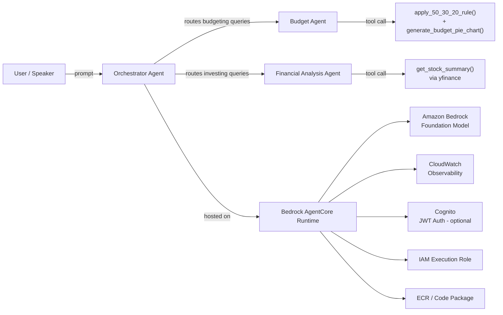

# Building Advanced Agentic Systems on AWS

### A Guide — From Single Agent to Production Deployment

**Audience:** Beginners to intermediate developers, cloud engineers, and architects **Format:** Live coding / live demo talk with real AWS resources (not slideware) **Duration guide:** \~35–45 min talk + 10–15 min live demo + Q&A

---

## 1. Why this talk matters

Generative AI demos are everywhere. What's rare is seeing a system that:

- Does something *useful* (personal finance, not a chatbot toy)
- Uses more than one agent that *collaborate*
- Is *actually deployed* to production infrastructure, not just a notebook
- Has *authentication, observability, and a cleanup story* — the parts most tutorials skip

This talk walks through exactly that, using a real AWS account, real deployed infrastructure, and a live test at the end.

**The one-sentence pitch:** *"We'll go from a single AI agent answering budgeting questions in a notebook, to a multi-agent financial system, to a production endpoint running on AWS — and I'll invoke it live."*

---

## 2. The use case: Personal Finance Assistant

Pick a use case everyone in the room already understands — budgeting and investing — so the audience spends zero energy understanding the *domain* and all their energy understanding the *architecture*.

| Capability | What it demonstrates |
| --- | --- |
| "I earn $5,000/month, how should I budget it?" | Natural language understanding + deterministic tool use (the 50/30/20 math is a real function, not an LLM guess) |
| "Generate a pie chart for that" | Agents producing real artifacts (files), not just text |
| "How has AAPL performed this week?" | Live external data retrieval (yfinance) inside an agent tool |
| "I earn $7,000/month, budget it, and how's AAPL doing?" | **Multi-agent orchestration** — one query, two specialists, one synthesized answer |
| Same `Agent` object across calls | Conversation memory — the agent remembers prior turns |
| `structured_output(FinancialReport)` | Typed, validated output (Pydantic) instead of parsing free text |

This maps to a real pattern enterprises care about: **a router/orchestrator agent delegating to specialist agents**, each with their own tools, instructions, and scope — instead of one giant prompt trying to do everything.

---

## 3. Requirements — what you need before you start

Be upfront with the audience that this is a **real AWS account** demo, not a sandbox. State the requirements plainly:

### AWS-side requirements

- An AWS account (personal/free-tier is fine) with billing enabled
- An IAM identity (user or SSO) with permissions for: Bedrock, Bedrock AgentCore, IAM (to create execution roles), ECR, CloudWatch Logs, CloudFormation, SSM, and optionally Cognito
- **Bedrock model access enabled** for an Anthropic Claude model in your chosen region (this is a one-time console approval step — call this out, it trips up almost everyone the first time)
- A region where Bedrock + AgentCore are both available (`us-east-1` is used throughout this project)

### Local tooling requirements

| Tool | Why |
| --- | --- |
| Python 3.12+ | Runs the agents and notebooks |
| AWS CLI v2 | Authentication + verification commands |
| Node.js 22+ | Runs the AgentCore CLI (`@aws/agentcore`), which is itself a Node tool that shells out to Python/CDK |
| `uv` (Astral) | Used internally by the AgentCore CDK packager to resolve Python dependencies for deployment — install via `winget install astral-sh.uv` on Windows |
| VS Code + Jupyter extension | Running the notebooks interactively |

### Conceptual prerequisites for the audience

- Basic Python (functions, decorators, dicts)
- What an LLM is and what "tool calling" / "function calling" means
- Basic familiarity with "what is IAM / what is a role" (one sentence is enough)

This talk is intentionally designed so a **beginner** can follow the narrative even if they've never touched Bedrock, and an **intermediate** engineer gets enough detail (model IDs, inference profiles, IAM specifics) to reproduce it themselves.

---

## 4. The architecture



**Narrate it like this for the audience:**

1. A user (or in our demo, me, live) sends a plain-English prompt.
2. It hits an **Orchestrator Agent** — its only job is to read the question and decide which specialist should handle it (or both).
3. Specialist agents (**Budget Agent**, **Financial Analysis Agent**) each have their own **tools** — real Python functions the LLM can call to get deterministic results instead of hallucinating numbers.
4. The whole thing is packaged and hosted on **Amazon Bedrock AgentCore Runtime** — this is what turns "a notebook that works on my machine" into "an HTTPS endpoint with IAM-based auth, logging, and auto-scaling."
5. Every model call goes to **Amazon Bedrock**, which hosts the actual foundation model (we use Anthropic Claude via Bedrock, not a direct Anthropic API key).

---

## 5. AWS services used, explained for this audience

Go through these **in the order the data flows**, not alphabetically — it reads like a story.

### Amazon Bedrock

The managed service that gives you API access to foundation models (Anthropic Claude, Amazon Nova, Meta Llama, etc.) without hosting any GPUs yourself. You call one consistent API (`Converse`/`ConverseStream`) regardless of which model you pick. In this lab, Bedrock is the "brain" — every agent's reasoning step is a Bedrock model call.

> **Beginner framing:** "Bedrock is AWS's menu of AI models, and you pay per request instead of running your own servers."

Key detail worth mentioning live: **newer Claude models on Bedrock require an inference profile ID** (e.g. `us.anthropic.claude-sonnet-4-6`) instead of the bare model ID — this is a real gotcha the audience will hit if they try this at home.

### Strands Agents SDK

An open-source Python SDK (not an AWS-exclusive product) for building agents: it handles the loop of "call the model → did it ask to use a tool? → run the tool → feed the result back → repeat until done." The `@tool` decorator is the core primitive — it turns any Python function into something the LLM can choose to call.

> **Beginner framing:** "This is the library that turns 'the AI wants to do X' into 'the AI actually ran a real Python function and got a real number back.'"

### Amazon Bedrock AgentCore

The production hosting layer for agents built with Strands (or other frameworks). It is **not** a model — it's the runtime, identity, and observability wrapper around your agent code. Specifically in this lab it provides:

- **AgentCore Runtime** — packages and hosts your `agent.py` as a managed, scaling HTTP service
- **AgentCore Identity** — inbound authentication for your endpoint, either AWS SigV4 (default) or Cognito-backed JWT
- **Observability** — structured logs and traces, viewable via CloudWatch GenAI Observability dashboards

> **Beginner framing:** "If Strands is the engine, AgentCore is the car — wheels, doors, a lock on the door (auth), and a dashboard (observability)."

### Amazon Cognito (optional identity layer)

A managed user directory and OAuth/OIDC token issuer. In this lab it's used optionally to replace "only AWS-credentialed callers can invoke this" with "anyone with a valid JWT from our user pool can invoke this" — the difference between an internal tool and something you'd expose to real end users.

### AWS IAM

Every piece of this has an identity and a permission boundary: the human deploying it, and the **execution role** AgentCore creates for the running agent itself (so the deployed code only has the AWS permissions it actually needs, not the deployer's full access).

### Amazon ECR (Elastic Container Registry)

AgentCore packages your Python code as a deployable artifact; ECR is where that packaged artifact is stored for the runtime to pull from.

### Amazon CloudWatch

Every invocation of the deployed agent emits structured logs (including full stack traces on error — this is how we diagnosed every bug during development) and traces, viewable as **CloudWatch → GenAI Observability**.

### AWS CDK + CloudFormation (under the hood)

The AgentCore CLI doesn't call raw AWS APIs directly — it generates a CDK app and synthesizes it to CloudFormation, which is what actually creates/updates/deletes your AWS resources. Worth a 30-second mention for the intermediate crowd: *"*`agentcore deploy` *is a friendly wrapper around* `cdk deploy`*."* This also means cleanup has to tear down a CloudFormation stack, not just "turn something off."

### yfinance (not AWS — call this out explicitly)

The one non-AWS dependency: a Python library for pulling public market data. Included to show that tools can call **any** external system, not just AWS services.

---

## 6. How each task was actually achieved

### Task 1 — Personal Budget Assistant (single agent)

**Goal:** one agent, two tools, memory, structured output.

```python
from strands import Agent, tool
from strands.models import BedrockModel

@tool
def apply_50_30_20_rule(monthly_income: float) -> dict:
    """Split monthly income into needs (50%), wants (30%), and savings (20%)."""
    return {
        "needs": round(monthly_income * 0.5, 2),
        "wants": round(monthly_income * 0.3, 2),
        "savings": round(monthly_income * 0.2, 2),
    }

model = BedrockModel(model_id=MODEL_ID, region_name=AWS_REGION)
budget_agent = Agent(model=model, tools=[apply_50_30_20_rule, generate_budget_pie_chart], ...)

response_1 = budget_agent("I earn $5000 a month, how should I budget it?")
response_2 = budget_agent("Can you make a pie chart for that?")  # same object = remembers context
```

**What to emphasize live:** the LLM never does the math itself — it *decides to call* `apply_50_30_20_rule`, and the actual arithmetic is deterministic Python. This is the difference between "an AI that might hallucinate numbers" and "an AI that knows when to delegate to code."

The notebook also demonstrates `budget_agent.structured_output(FinancialReport, ...)` — forcing the final answer into a validated Pydantic schema instead of parsing free text with regex.

**Status:** fully run and tested — outputs verified (needs/wants/savings split, generated `budget_chart.png`, structured JSON report).

### Task 2 — Multi-Agent System ("Agents as Tools")

**Goal:** show that an *agent* can itself be wrapped as a *tool* for another agent — this is the core pattern of the whole talk.

```python
@tool
def budget_assistant(query: str) -> str:
    """Use this tool for any budgeting, spending, or savings questions."""
    return str(budget_agent(query))

@tool
def financial_analysis_assistant(query: str) -> str:
    """Use this tool for stock, portfolio, or market analysis questions."""
    return str(financial_agent(query))

orchestrator = Agent(
    model=model,
    tools=[budget_assistant, financial_analysis_assistant],
    system_prompt="You are a financial orchestrator. Route budgeting questions to budget_assistant "
                  "and investing/stock questions to financial_analysis_assistant...",
)
```

**What to emphasize live:** the orchestrator never sees `apply_50_30_20_rule` or `get_stock_summary` directly — it only sees two "black box" tools (`budget_assistant`, `financial_analysis_assistant`). This is how you scale an agent system: compose smaller, well-scoped agents instead of one agent with 30 tools and a 2-page system prompt.

Tested with a combined query that required **both** specialists to run and the orchestrator to synthesize a single coherent answer.

**Status:** fully run and tested — individual routing confirmed for budgeting-only and stock-only prompts, and combined routing confirmed for a query spanning both domains.

### Task 3 — Deploy with Amazon Bedrock AgentCore

**Goal:** take the exact orchestrator from Task 2 and make it a real, callable, authenticated AWS endpoint.

The only change from the notebook version: wrap the entrypoint for AgentCore's app runtime —

```python
from bedrock_agentcore.runtime import BedrockAgentCoreApp

app = BedrockAgentCoreApp()

@app.entrypoint
def invoke(payload: dict) -> dict:
    prompt = payload.get("prompt", "")
    result = orchestrator(prompt)
    return {"result": str(result)}
```

Then three CLI commands turn that file into live infrastructure:

```powershell
agentcore create --name AgenticLab --no-agent
agentcore add agent --name BudgetOrchestrator --type byo `
  --code-location ..\agentcore_app --entrypoint agent.py `
  --language Python --framework Strands --model-provider Bedrock
agentcore deploy -y
```

Behind the scenes this provisions: an IAM execution role, an ECR repository, the AgentCore Runtime itself, and CloudWatch log groups — all via a generated CDK app.

**What to emphasize live:** this is the exact same `Agent` code from the notebook. Nothing about the agent logic changed to go from "demo in a notebook" to "production HTTPS endpoint" — only the hosting wrapper.

### Task 4 — Clean up

Because this all costs real money while deployed, the lab ends with a teardown script (`cleanup.py`) that removes the AgentCore runtime, its ECR repo, its IAM role, the Cognito pool (if created), and the underlying CDK bootstrap stack — with manual console verification steps as a safety net.

**Talking point:** *"A production system isn't done until you can also tear it down cleanly — that's part of the architecture, not an afterthought."*

---

## 7. Common pitfalls to mention (these build credibility with intermediate attendees)

- **Model ID vs. inference profile ID:** some Bedrock models only accept an inference-profile-prefixed ID (`us.anthropic....`) for `Converse`/`ConverseStream`, not the bare model ID — you'll get `ValidationException: ...on-demand throughput isn't supported`.
- **AWS Marketplace billing for model access:** Anthropic models on Bedrock are fulfilled through AWS Marketplace, which requires a valid payment method on the account — a billing issue can look identical to a permissions issue at first (`AccessDeniedException`).
- `agentcore deploy` **needs real CloudFormation permissions**, not just Bedrock permissions, because it's deploying a CDK app under the hood.
- **CDK bootstrap (**`CDKToolkit` **stack) is shared per account/region** — tearing it down as part of cleanup affects any other CDK app in that account/region, not just this lab.
- **Windows-specific:** the `agentcore` CLI shim needs the `.cmd` extension when launched from a Python `subprocess.run(["agentcore", ...])` call, or you'll get a `FileNotFoundError` that has nothing to do with AgentCore itself.

---

## 8. Live demo script (10–15 minutes)

Keep this tight — the audience wants to *see it work*, not watch you type.

1. **Show the deployed status** (30s):

   ```powershell
   agentcore status
   ```

2. **Invoke a budgeting-only prompt** (1–2 min, read the response out loud):

   ```powershell
   agentcore invoke "I earn $6000 a month, how should I budget it?"
   ```

3. **Invoke a stock-only prompt** (1–2 min):

   ```powershell
   agentcore invoke "How has AAPL performed over the last 5 days?"
   ```

4. **Invoke a combined prompt** — this is the "wow" moment, show both specialists firing from one orchestrator call:

   ```powershell
   agentcore invoke "I earn $6000/month, how should I budget it, and how is AAPL doing this week?"
   ```

5. **Show observability** — pull up CloudWatch → GenAI Observability (or `agentcore logs --since 1h`) and point at the trace for the call you just made. *"This is the same request you just watched happen, with full timing and tool-call breakdown."*

6. **(Optional) Show a deliberate failure** — if time allows, this is memorable: show a log entry from development with a real error (e.g., a retired model ID) and how the stack trace pinpointed the exact line and model ID. Reinforces "this is real infrastructure, not a scripted demo."

---

## 9. Closing takeaways for the audience

- An **agent** is just an LLM + a loop + tools. The LLM provides judgement; the tools provide facts and actions.
- **Agents-as-tools** is how you scale past one giant prompt — compose specialists instead.
- **Bedrock** gives you the model; **AgentCore** gives you the production runtime around it — they're complementary, not competing, services.
- Going from notebook → production required **zero changes to the agent logic** — only a hosting wrapper and a CLI deploy step.
- Cleanup and cost awareness are part of the architecture, not an afterthought.

### Resources to share at the end

- Strands Agents SDK: open-source agent framework used throughout
- Amazon Bedrock AgentCore docs (console → Bedrock → AgentCore)
- This project's [SETUP_GUIDE.md](SETUP_GUIDE.md) for the full step-by-step walkthrough
- [QUICK_DEPLOY.md](QUICK_DEPLOY.md) for the minimal path to redeploy and test live, if attendees want to follow along on their own account afterward